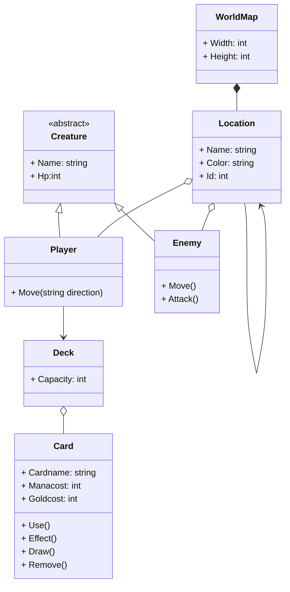

```mermaid
classDiagram
    class WorldMap {
        + Width: int
        + Height: int
    }
    class Location{
        + Name: string
        + Color: string
        + Id: int
    }
    class Creature{
        <<abstract>>
        + Name: string
        + Hp:int
    }
    class Player{
        + Move(string direction)
    }
    class Enemy{
        + Move()
        + Attack()
    }
    class Card{
        + Cardname: string
        + Manacost: int
        + Goldcost: int
        + Use()
        + Effect()
        + Draw()
        + Remove()
    }
    class Deck{
        + Capacity: int
    }
    Creature <| --Player
    Creature <| --Enemy
    Location --> Location
    WorldMap *-- Location
    Player --> Deck
    Deck o-- Card
    Location o--Enemy
    Location o--Player


```
